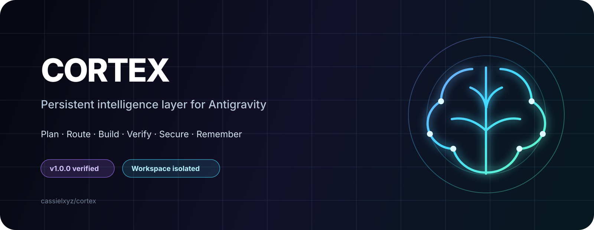
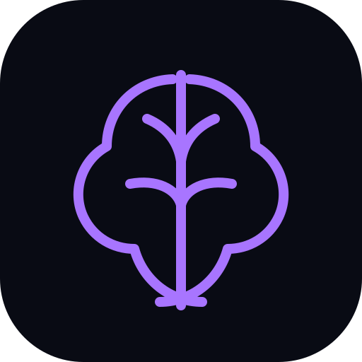

<div align="center">
  

  <br/>

  <strong>Give Antigravity a reliable engineering workflow, selective skills, durable memory, verification, and recovery.</strong>

  <br/><br/>

  
  
  
  
</div>

---

## What is Cortex?

Cortex is a lightweight orchestration extension for **Google Antigravity**. It does not replace Gemini or pretend to change the underlying model. Instead, it improves the way the agent works around the model:

```text
restore context
      ↓
inspect repository
      ↓
research only when needed
      ↓
plan + architecture
      ↓
select the smallest useful skill set
      ↓
implement
      ↓
verify with real tools
      ↓
security gate when relevant
      ↓
checkpoint actual state
      ↓
continue from the real unfinished task
```

The result is a more disciplined, efficient, and persistent Antigravity workflow for long-running software projects.

## Why Cortex?

Antigravity is powerful, but long autonomous sessions can still suffer from repeated work, stale context, over-loaded prompts, unverified completion claims, and session/quota interruptions. Cortex adds a control layer around those weak points.

| Problem | Cortex response |
|---|---|
| Agent forgets where it stopped | Git-aware checkpoints + recovery capsules |
| `continue` repeats old work | Reconcile checkpoint against current repository state |
| Too many skills waste context | Route only the minimum useful skills |
| UI is called complete without inspection | Playwright/browser verification workflow |
| Agent claims success after only writing code | Deterministic verification gate |
| Long history consumes tokens | HOT / WARM / COLD context governor |
| Security is forgotten until the end | Routed OWASP/Strix-aware security gate |
| Other orchestrators are installed | Hard workspace ownership and isolation |

## The workflow

Cortex gives Antigravity a task-aware engineering loop instead of one giant permanent prompt.

### New feature

```text
requirements → inspect → plan → implement → test → runtime verify → security → checkpoint
```

### Bug fix

```text
reproduce → diagnose → research if needed → fix → regression test → verify → checkpoint
```

### UI / UX

```text
inspect → design routing → implement → Playwright → responsive/accessibility review → repair → verify
```

### Release

```text
full tests → build → dependency/security checks → OWASP review → optional Strix → final checkpoint
```

## Selective skills

Cortex keeps a trusted skill catalog and activates skills only when the task benefits from them. The current routing catalog includes support for workflows around:

- **Superpowers** — planning and disciplined implementation workflows
- **Agent Reach** — external research when current information is actually needed
- **UI/UX Pro Max** — frontend and interface quality
- **Taste Skill** — visual/design-system reasoning and image-to-code workflows
- **Web Design Guidelines** — frontend quality guidance
- **Awesome Design** — design inspiration and implementation guidance
- **Caveman Skill** — compact context/token discipline
- **Playwright** — browser inspection and interaction verification
- **OWASP + optional Strix** — final security review

Third-party skills remain governed by their own licenses and upstream behavior. Cortex never runs random upstream installer scripts: trusted repositories are cloned, validated, namespaced, and copied as static skill packages.

## Memory that survives the chat

Cortex does not depend on one Antigravity conversation as the source of truth.

Durable state is stored outside the project:

```text
~/.antigravity-cortex/
└── projects/
    └── <stable-project-id>/
        ├── workspace.json
        ├── latest-checkpoint.json
        ├── LATEST_RESUME.md
        ├── LATEST_RESUME.json
        ├── checkpoints/
        └── hook-events/
```

Checkpoints are created on meaningful events and as a five-minute fallback. If credits disappear before the latest checkpoint, Cortex compares the checkpoint against current Git HEAD, branch, status, changed files, and recent events before resuming.

So this:

```text
continue
```

is treated more like:

```text
Recover the real current project state.
Do not overwrite newer work.
Verify previously claimed completion.
Continue from the first genuinely unfinished task.
```

## Safe coexistence with DockyardOS

Cortex is deliberately isolated from **DockyardOS** and other known orchestrators.

- the editor extension may be installed globally;
- the Cortex Antigravity plugin activates only in a workspace you explicitly enable;
- Cortex refuses primary ownership inside the DockyardOS repository;
- an active DockyardOS plugin blocks Cortex by default;
- observer mode has no execution/checkpoint authority;
- Cortex never writes into DockyardOS/GameFoundry state paths;
- downloaded skills are namespaced `cortex-*`;
- private Cortex workspace files are locally excluded from Git so they are not accidentally pushed.

```text
DockyardOS workspace              Cortex workspace
        │                               │
 dockyardos plugin                cortex plugin
 dockyard memory                  cortex memory
        │                               │
 Cortex = blocked                DockyardOS untouched
```

## Install

### Fastest install — recommended

Download the latest verified extension:

**[Download Cortex VSIX](https://github.com/cassielxyz/cortex/releases/latest/download/antigravity-cortex-latest.vsix)**

Then:

1. Open **Antigravity**.
2. Open **Extensions**.
3. Choose **Install from VSIX…**.
4. Select `antigravity-cortex-latest.vsix`.
5. Open the project you want Cortex to manage.
6. Click **`Initialize Cortex`** in the Antigravity status bar.

That is the complete normal-user setup. Cortex performs the rest automatically once for that project.

### What the Initialize button does

```text
Initialize Cortex
      ↓
check workspace ownership / DockyardOS isolation
      ↓
install or refresh the workspace-scoped Cortex plugin
      ↓
install all allow-listed trusted skills (static copy; no upstream installers)
      ↓
configure safe MCP defaults
      ↓
create project identity + durable recovery state
      ↓
create baseline checkpoint
      ↓
run deterministic project verification
      ↓
run safe built-in security checks
      ↓
run Cortex Doctor
      ↓
create final checkpoint + resume capsule
      ↓
Cortex Ready
```

Initialization is **idempotent**. Cortex stores an initialization receipt for the project, so reopening Antigravity does not reinstall everything. If a skill download or verification step needs attention, the status-bar action changes to **Repair Cortex** and retries the missing setup.

Cortex also displays a one-time **Initialize Cortex** notification for eligible, uninitialized workspaces. DockyardOS workspaces remain blocked by default and are never taken over.

### Build from source

Requirements: Node.js + Git.

```bash
git clone https://github.com/cassielxyz/cortex.git
cd cortex
npm test
npm run check
npm run package:vsix
```

Install the generated `.vsix`, open a project, then click **Initialize Cortex** in the status bar.

## First use

After the initializer reports **Cortex Ready**, use Antigravity normally. There is no required Cortex command sequence and no special prompt format.

```text
Build the authentication flow and verify it.
```

```text
Fix this UI and inspect every important interaction.
```

```text
continue
```

Cortex still exposes advanced commands for debugging/manual control, but normal users do not need them.

## What happens when the agent tries to finish?

Cortex distinguishes writing code from proving that the feature works.

```text
written ≠ implemented ≠ verified
```

The completion gate can check relevant evidence such as:

- repository/file state;
- syntax/build/lint/test results;
- runtime behavior;
- Playwright/browser checks for UI tasks;
- secret scanning;
- dependency/security checks when configured;
- final checkpoint state.

Possible internal states include `in progress`, `implemented`, `partially verified`, `verified`, `blocked`, and `failed`.

## Security defaults

Cortex is conservative by default:

- Inspo MCP is disabled until explicitly enabled;
- external security scanners are disabled until explicitly allowed;
- Strix requires an authorized local target/configuration;
- unavailable scanners are reported as unavailable, never silently counted as a pass;
- the built-in secret scanner reports file/line locations without echoing discovered secret values;
- skill packages reject unsafe symlinks and oversized content.

See [`docs/SECURITY.md`](docs/SECURITY.md).

## Commands

| Command | Purpose |
|---|---|
| `Cortex: Initialize Project (One Click)` | Perform the complete one-time project setup |
| `Cortex: Enable for Workspace` | Legacy alias for the one-click initializer |
| `Cortex: Disable for Workspace` | Remove Cortex workspace activation |
| `Cortex: Save Checkpoint` | Persist the current repository/task state |
| `Cortex: Resume Project` | Rebuild a compact resume capsule from actual state |
| `Cortex: Show Status` | Show ownership/checkpoint/runtime status |
| `Cortex: Doctor` | Check Git, Node, plugin state and requirements |
| `Cortex: Route Task & Ensure Skills` | Select/install the smallest useful skill set |
| `Cortex: Install Trusted Skills` | Install allow-listed namespaced skills |
| `Cortex: Verify Workspace` | Run deterministic project verification |
| `Cortex: Security Audit` | Run built-in and configured security gates |
| `Cortex: Toggle Inspo MCP` | Enable/disable optional Inspo MCP integration |

## Verification

The production package has passed the complete local verification suite, including clean-room extraction and package checks.

```text
17 / 17 automated tests passed
```

Run the same checks locally:

```bash
npm test
npm run check
```

Release installers, packaged source, the verification report, and checksums are published as verified assets on the [latest Cortex GitHub Release](https://github.com/cassielxyz/cortex/releases/latest). The source tree and CI remain available for independent auditing and rebuilds.

## Repository map

```text
cortex/
├── antigravity-plugin/   workspace-scoped agents, skills, rules and hooks
├── assets/               Cortex branding
├── catalog/              trusted skill routing catalog
├── docs/                 architecture, isolation, install and security docs
├── dist/                 generated local build output
├── scripts/              package and verification helpers
├── src/                  Cortex runtime
├── test/                 isolation, memory, routing and security tests
├── extension.js          VS Code/Antigravity extension entry
└── package.json
```

## Philosophy

> **Maximum useful capability. Minimum active context. Repository truth. Evidence before completion.**

Cortex is built to make the model spend its intelligence on the actual problem instead of repeatedly rediscovering the project.

---

<div align="center">
  
  <br/><br/>
  <strong>Cortex</strong><br/>
  Persistent engineering intelligence for Antigravity.
</div>
